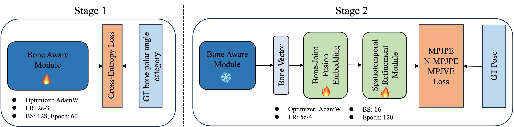
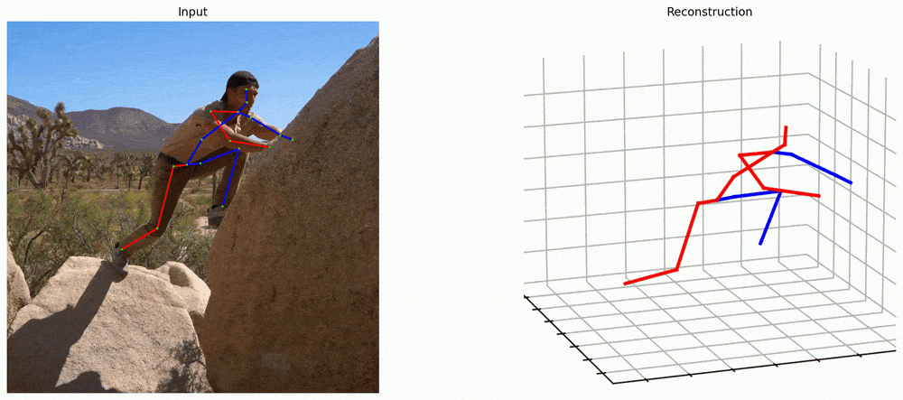

# 🌀 Mamba-Driven Topology Fusion for Monocular 3D Human Pose Estimation (Published on Image and Vision Computing)


Official PyTorch implementation of our paper:
**"Mamba-Driven Topology Fusion for Monocular 3D Human Pose Estimation"**
📄 *Zenghao Zheng, Lianping Yang, Jinshan Pan, Hegui Zhu*   

[[Paper]](https://doi.org/10.48550/arXiv.2505.20611) ｜ [[Project Page]](https://github.com/ZenghaoZheng/MDTF-3DHPE) ｜[[Video]](https://youtu.be/ujZxNtj1NXc)

---

## 🌟 Highlights

* ⚙️ **Mamba-Driven Topology Fusion (MDTF)** — a novel framework that integrates human topology priors into the Mamba sequence model.
* 🦴 **Bone Aware Module (BAM)** — provides global topological guidance in spherical coordinates.
* 🔁 **GCN-Enhanced Vision Mamba (GEM)** — enhances Mamba with bidirectional GCN to capture local spatial dependencies.
* 🧩 **Bone-Joint Fusion Embedding** — fuses joint and bone information from different coordinate systems.
* 🕒 **Spatiotemporal Refinement Module** — refines fused features for accurate 3D pose regression.
* 🚀 Achieves **40.0 mm MPJPE on Human3.6M** with only **1/9** the computational cost of MixSTE.

---

## Installation

```bash
git clone https://github.com/ZenghaoZheng/MDTF-3DHPE.git
cd MDTF-3DHPE
conda create -n mdtf python=3.8
conda activate mdtf
pip install -r requirements.txt
```

---

## 📦 Dataset Preparation

### 1. Human3.6M

Download the fine-tuned Stacked Hourglass detections of [MotionBERT](https://github.com/Walter0807/MotionBERT/blob/main/docs/pose3d.md)’s preprocessed Human3.6M data:

🔗 [Download Here](https://1drv.ms/u/s!AvAdh0LSjEOlgU7BuUZcyafu8kzc?e=vobkjZ)

Unzip it to:

```
data/motion3d
```

Then, slice the motion clips:

```bash
cd data/preprocess
python h36m.py --n-frames 243
python h36m.py --n-frames 81
python h36m.py --n-frames 27
```

---

## 🧩 Framework Overview

<p align="center">
  
</p>

* **Stage 1:** Train the Bone Aware Module to infer bone vector orientations (spherical coordinates).
* **Stage 2:** Fuse joint–bone features via Bone-Joint Embedding and refine them with Spatiotemporal Refinement Module.

---
## 🧠 Training

Our training process is divided into **two stages**, corresponding to the **Bone Aware Module (Stage 1)** and the **Fusion and Refinement Network (Stage 2)**.

### 🩻 Stage 1 – Train Bone Aware Module

```bash
python train_firststage.py \
  --config configs/h36m/first.yaml \
  --new-checkpoint checkpoint/stage1 \
  --use-wandb --wandb-name boneawaremodule_stage1
```

### 🧩 Stage 2 – Train Bone-Joint Fusion Embedding & Spatiotemporal Refinement Module

**Tiny model:**

```bash
python train_twostage.py \
  --config configs/h36m/tiny.yaml \
  --new-checkpoint checkpoint/stage2/tiny \
  --use-wandb --wandb-name stage2_tiny
```

**Large model:**

```bash
python train_twostage.py \
  --config configs/h36m/large.yaml \
  --new-checkpoint checkpoint/stage2/large \
  --use-wandb --wandb-name stage2_large
```

**Resume training:**

```bash
python train_twostage.py \
  --config configs/h36m/tiny.yaml \
  --resume \
  --checkpoint checkpoint/stage2/tiny/ \
  --new-checkpoint checkpoint/stage2/tiny/
```

---
## 💾 Pretrained Weights

You can download pretrained weights for quick evaluation or fine-tuning.

| Stage            | Model             | Download Link                                                                                            | Save To                    |
| ---------------- | ----------------- | -------------------------------------------------------------------------------------------------------- | -------------------------- |
| Stage 1         | Bone Aware Module | [Google Drive 🔗](https://drive.google.com/file/d/17CFDOW2JFeVfTLwF0BbTZuV5kW0qUV7b/view?usp=drive_link) | `checkpoint/stage1/`       |
| Stage 2 (Tiny) | MDTF-Tiny Model   | [Google Drive 🔗](https://drive.google.com/file/d/1x9-45205xWoQaVB95_WRxS3k2Mr7IDlG/view?usp=sharing)    | `checkpoint/stage2/tiny/`  |
| Stage 2 (Large) | MDTF-Large Model  | [Google Drive 🔗](https://drive.google.com/file/d/18mRUdE4B5Pc0KB321tltKLMWZEksNWl3/view?usp=sharing)    | `checkpoint/stage2/large/` |

---
## 🧪 Evaluation

Evaluate pretrained checkpoints on **Human3.6M**:

```bash
python train.py \
  --eval-only \
  --checkpoint checkpoint/stage2/tiny \
  --checkpoint-file best_epoch.pth.tr \
  --config configs/h36m/tiny.yaml
```

---

## 🎬 Demo

Our demo builds upon the visualization pipeline from [MHFormer](https://github.com/Vegetebird/MHFormer).

### 1. Download dependencies

* YOLOv3 and HRNet pretrained models from [here](https://drive.google.com/drive/folders/1_ENAMOsPM7FXmdYRbkwbFHgzQq_B_NQA?usp=sharing)
  → Place in `./demo/lib/checkpoint`
* Prepare the pre-trained checkpoint of the MDTF model according to Evaluation

### 2. Place your videos

```
./demo/video/sample_video.mp4
```

### 3. Run the demo

```bash
python demo/vis.py --video sample_video.mp4
```

<p align="center">
  
</p>

---

## 📊 Performance

| Dataset      | Model      | MPJPE ↓     | Params | MACs/frame | P-MPJPE ↓   |
| ------------ | ---------- | ----------- | ------ | ---------- | ----------- |
| Human3.6M    | Ours-Tiny  | **41.7 mm** | 0.9 M  | 12.8 M     | 34.8 mm     |
| Human3.6M    | Ours-Large | **40.0 mm** | 4.4 M  | 58.7 M     | **33.5 mm** |
| MPI-INF-3DHP | Ours-Large | **15.3 mm** | 4.4 M  | 58.7 M     | —           |

> ✨ *Our MDTF framework achieves a 0.9 mm improvement over PoseMamba and reduces computation by 9× compared to MixSTE.*


<!---
## 📚 Citation

If you find this work useful, please cite our paper:

```bibtex
@article{zheng2025mdtf,
  title={Mamba-Driven Topology Fusion for Monocular 3D Human Pose Estimation},
  author={Zheng, Zenghao and Yang, Lianping and Pan, Jinshan and Zhu, Hegui},
  journal={Image and Vision Computing},
  year={2025}
}
```
-->
---

## 🤝 Acknowledgements

We thank the authors of [MotionBERT](https://github.com/Walter0807/MotionBERT) and [MHFormer](https://github.com/Vegetebird/MHFormer) for their open-source contributions that inspired this project.

---
